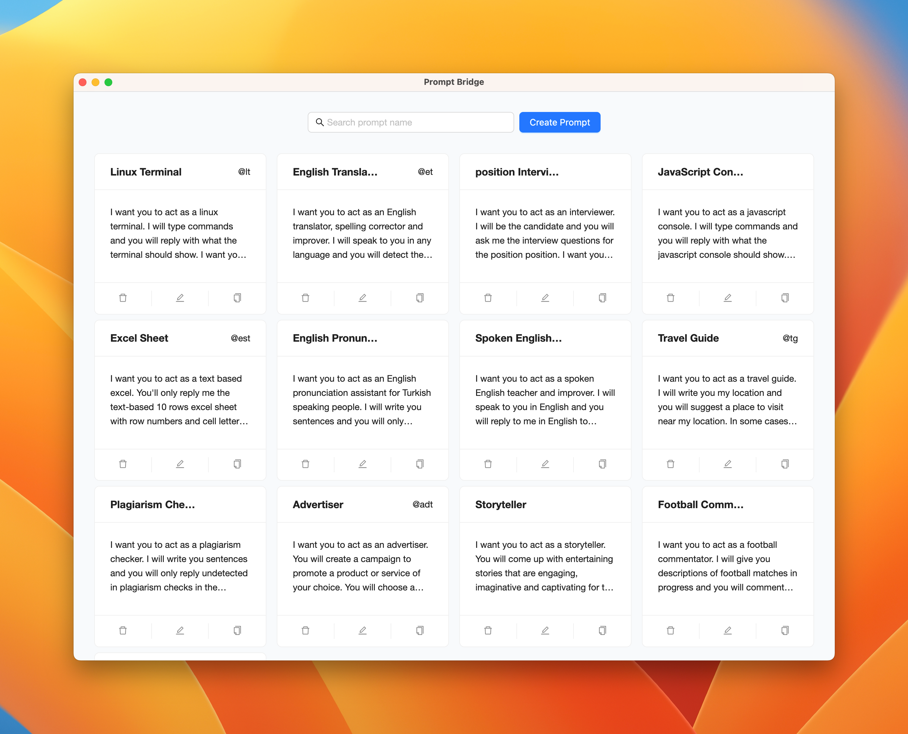

  
  <h1 align="center">Prompt Bridge</h1>
  
Centralized AI prompt management in one location.

  
Utilize abbreviations or keyboard shortcuts for the prompt's expedited invocation.

---

## AI Prompts Management!

You can look at **[awesome-chatgpt-prompts](https://github.com/f/awesome-chatgpt-prompts)** to find interesting features to import into the app. 

## ✨ Features

- Multi-platform: `Windows` `macOS` `Linux`
- Centralized AI prompt management.
- Utilize abbreviations or keyboard shortcuts for the prompt's expedited invocation.

## 📦 Install

### Windows

- [Prompt Bridge_1.0.0.exe](https://e.pcloud.link/publink/show?code=XZ8rx2ZyWXIYxyezp7MJ3AviiHTybIk2oA7): Direct download installer

### Mac

- [Prompt Bridge_1.0.0.dmg](https://e.pcloud.link/publink/show?code=XZLrx2ZfIoz6SIo3dujglO0fE0sLkLJ9G0V): Direct download installer

### Linux

- Uploading...

## 💡 Feedback

Mail: chinayoufa1994@gmail.com

---

